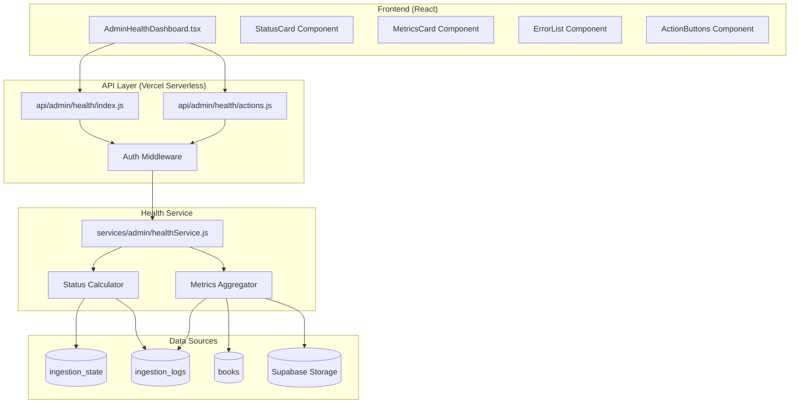

# Design Document: Admin Health Dashboard

## Overview

The Admin Health Dashboard provides a secure, read-only interface for monitoring the PUEA Digital Library's automated systems. It aggregates health metrics from ingestion, maintenance, storage, and AI classification services into a single dashboard accessible only to authorized administrators.

The system is designed to be:
- **Secure**: Environment-based authentication, no sensitive data exposure
- **Fast**: Optimized queries, minimal joins, server-side rendering
- **Actionable**: Clear status indicators, safe admin controls
- **Extensible**: Modular components, structured API responses

## Architecture



## Components and Interfaces

### 1. Health API Endpoint (`api/admin/health/index.js`)

Main endpoint for fetching all health metrics.

```javascript
/**
 * GET /api/admin/health
 * Returns comprehensive health metrics for the dashboard
 * 
 * Headers:
 *   Authorization: Bearer <ADMIN_HEALTH_SECRET>
 * 
 * Response: HealthMetrics
 */
export default async function handler(req, res) {
  // Validate authorization
  // Fetch and aggregate metrics
  // Return structured response
}
```

### 2. Actions API Endpoint (`api/admin/health/actions.js`)

Endpoint for triggering admin actions.

```javascript
/**
 * POST /api/admin/health/actions
 * Triggers admin actions (ingestion, maintenance, pause/resume)
 * 
 * Headers:
 *   Authorization: Bearer <ADMIN_HEALTH_SECRET>
 * 
 * Body:
 *   { action: 'trigger_ingestion' | 'trigger_maintenance' | 'pause_ingestion' | 'resume_ingestion' }
 * 
 * Response: ActionResult
 */
export default async function handler(req, res) {
  // Validate authorization
  // Execute action
  // Log action
  // Return result
}
```

### 3. Health Service (`services/admin/healthService.js`)

Core service for aggregating health metrics.

```javascript
/**
 * Fetches comprehensive health metrics from all sources
 * @returns {Promise<HealthMetrics>}
 */
export async function getHealthMetrics() {
  const [systemStatus, dailyMetrics, ingestionProgress, storageHealth, errorSummary] = 
    await Promise.all([
      getSystemStatus(),
      getDailyMetrics(),
      getIngestionProgress(),
      getStorageHealth(),
      getErrorSummary()
    ]);
  
  return { systemStatus, dailyMetrics, ingestionProgress, storageHealth, errorSummary };
}

/**
 * Calculates system status based on timestamps and error counts
 * @returns {Promise<SystemStatus>}
 */
export async function getSystemStatus() {
  // Query ingestion_state and ingestion_logs
  // Apply status calculation rules
}

/**
 * Aggregates daily metrics from ingestion logs
 * @returns {Promise<DailyMetrics>}
 */
export async function getDailyMetrics() {
  // Query today's ingestion_logs
  // Count books with genres added today
}

/**
 * Gets current ingestion progress
 * @returns {Promise<IngestionProgress>}
 */
export async function getIngestionProgress() {
  // Query ingestion_state table
}

/**
 * Gets storage health metrics
 * @returns {Promise<StorageHealth>}
 */
export async function getStorageHealth() {
  // Query books table for PDF counts
  // Estimate storage usage
}

/**
 * Gets recent errors and actions
 * @returns {Promise<ErrorSummary>}
 */
export async function getErrorSummary() {
  // Query ingestion_logs for errors
  // Get last AI classification error
}
```

### 4. Dashboard Component (`components/AdminHealthDashboard.tsx`)

Main React component for the health dashboard.

```typescript
interface AdminHealthDashboardProps {
  // No props - fetches data internally
}

const AdminHealthDashboard: React.FC = () => {
  const [metrics, setMetrics] = useState<HealthMetrics | null>(null);
  const [loading, setLoading] = useState(true);
  const [error, setError] = useState<string | null>(null);
  
  // Fetch metrics on mount
  // Render status cards, metrics, errors, and action buttons
};
```

## Data Models

### API Response Types

```typescript
interface HealthMetrics {
  systemStatus: SystemStatus;
  dailyMetrics: DailyMetrics;
  ingestionProgress: IngestionProgress;
  storageHealth: StorageHealth;
  errorSummary: ErrorSummary;
  timestamp: string;
}

interface SystemStatus {
  ingestion: HealthStatus;
  maintenance: HealthStatus;
  aiClassification: HealthStatus;
  overall: HealthStatus;
}

type HealthStatus = 'healthy' | 'warning' | 'failed';

interface DailyMetrics {
  booksIngested: number;
  booksSkipped: number;
  booksFailed: number;
  booksClassified: number;
  classificationFailures: number;
  date: string;
}

interface IngestionProgress {
  source: string;
  lastPage: number;
  lastCursor: string | null;
  totalIngested: number;
  lastRunAt: string | null;
  lastRunStatus: string;
}

interface StorageHealth {
  totalPdfs: number;
  estimatedSizeMb: number;
  orphanedFiles: number | null;
  corruptFiles: number | null;
}

interface ErrorSummary {
  ingestionErrors: ErrorEntry[];
  maintenanceActions: ActionEntry[];
  lastAiError: ErrorEntry | null;
}

interface ErrorEntry {
  timestamp: string;
  type: string;
  message: string;
  identifier?: string;
}

interface ActionEntry {
  timestamp: string;
  action: string;
  result: string;
}

interface ActionResult {
  success: boolean;
  action: string;
  message: string;
  timestamp: string;
}
```

### Database Queries

```sql
-- Get system status from ingestion_state
SELECT 
  source,
  last_run_at,
  last_run_status,
  last_run_failed,
  total_ingested
FROM ingestion_state
WHERE source = 'internet_archive';

-- Get daily metrics from ingestion_logs
SELECT 
  COALESCE(SUM(books_added), 0) as books_ingested,
  COALESCE(SUM(books_skipped), 0) as books_skipped,
  COALESCE(SUM(books_failed), 0) as books_failed
FROM ingestion_logs
WHERE started_at >= CURRENT_DATE
  AND started_at < CURRENT_DATE + INTERVAL '1 day';

-- Get books classified today
SELECT COUNT(*) as classified_count
FROM books
WHERE genres IS NOT NULL
  AND created_at >= CURRENT_DATE
  AND created_at < CURRENT_DATE + INTERVAL '1 day';

-- Get error count in last 24 hours
SELECT COUNT(*) as error_count
FROM ingestion_logs
WHERE status = 'failed'
  AND started_at >= NOW() - INTERVAL '24 hours';

-- Get recent errors
SELECT 
  started_at as timestamp,
  status as type,
  error_details
FROM ingestion_logs
WHERE error_details IS NOT NULL
ORDER BY started_at DESC
LIMIT 10;

-- Get storage metrics
SELECT 
  COUNT(*) as total_pdfs,
  COUNT(*) FILTER (WHERE pdf_url IS NOT NULL) as with_pdf
FROM books
WHERE source = 'internet_archive';
```

## Status Calculation Logic

The system status is calculated using the following rules:

```javascript
function calculateStatus(lastRunAt, lastRunStatus, errorCount24h) {
  // Rule 1: If last run failed, status is 'failed'
  if (lastRunStatus === 'failed') {
    return 'failed';
  }
  
  // Rule 2: If no run in 48 hours, status is 'warning'
  const hoursSinceLastRun = lastRunAt 
    ? (Date.now() - new Date(lastRunAt).getTime()) / (1000 * 60 * 60)
    : Infinity;
  
  if (hoursSinceLastRun > 48) {
    return 'warning';
  }
  
  // Rule 3: If more than 5 errors in 24 hours, status is 'warning'
  if (errorCount24h > 5) {
    return 'warning';
  }
  
  // Rule 4: Otherwise, status is 'healthy'
  return 'healthy';
}
```

## Correctness Properties

*A property is a characteristic or behavior that should hold true across all valid executions of a system—essentially, a formal statement about what the system should do.*

### Property 1: Authorization Enforcement

*For any* request to the Health_API without a valid ADMIN_HEALTH_SECRET, the API SHALL return a 401 status code and not expose any metrics data.

**Validates: Requirements 1.2, 1.3, 1.4**

### Property 2: Status Calculation Consistency

*For any* combination of lastRunAt, lastRunStatus, and errorCount24h values, the calculated status SHALL be exactly one of: 'healthy', 'warning', or 'failed', following the defined rules.

**Validates: Requirements 2.4, 2.5, 2.6, 2.7**

### Property 3: Metrics Non-Negativity

*For any* daily metrics response, all count values (booksIngested, booksSkipped, booksFailed, booksClassified, classificationFailures) SHALL be non-negative integers.

**Validates: Requirements 3.1, 3.2, 3.3, 3.4, 3.5, 3.6**

### Property 4: Action Logging Completeness

*For any* admin action triggered through the Health_API, the action SHALL be logged with a timestamp and the action type before returning a response.

**Validates: Requirements 7.5, 7.6**

### Property 5: Error Message Sanitization

*For any* error displayed in the error summary, the message SHALL NOT contain stack traces, file paths, or sensitive credentials.

**Validates: Requirements 1.5, 6.5**

## Error Handling

### Error Categories

1. **Authentication Errors**: Invalid or missing authorization
   - Response: 401 Unauthorized
   - No metrics data exposed

2. **Database Errors**: Failed queries to Supabase
   - Response: 503 Service Unavailable
   - Log error details server-side

3. **Timeout Errors**: Query takes too long
   - Response: 504 Gateway Timeout
   - Return partial data if available

4. **Action Errors**: Failed admin action
   - Response: 500 Internal Server Error
   - Return error message, log details

### Error Response Format

```typescript
interface ErrorResponse {
  error: string;
  message: string;
  timestamp: string;
}
```

## Testing Strategy

### Property-Based Testing

Use `fast-check` library for property-based tests.

**Test Files:**
- `tests/admin-health/authorization.property.test.ts` - Property 1
- `tests/admin-health/statusCalculation.property.test.ts` - Property 2
- `tests/admin-health/metricsValidation.property.test.ts` - Property 3
- `tests/admin-health/actionLogging.property.test.ts` - Property 4

### Unit Tests

- Test status calculation with various input combinations
- Test metrics aggregation with mock data
- Test error message sanitization

### Integration Tests

- Test full API flow with valid/invalid auth
- Test action triggers with mock services

## Security Considerations

1. **Environment Secret**: ADMIN_HEALTH_SECRET must be set in production
2. **No Sensitive Data**: API responses never include API keys, passwords, or tokens
3. **Read-Only by Default**: Dashboard only displays data, actions are explicit
4. **Action Logging**: All admin actions are logged for audit trail
5. **No Destructive Actions**: No delete, drop, or truncate operations available

## Configuration

### Environment Variables

```bash
# Required for dashboard access
ADMIN_HEALTH_SECRET=your-secret-key-here

# Existing variables (already configured)
SUPABASE_URL=...
SUPABASE_SERVICE_KEY=...
```

### Adding New Metrics

To add a new metric to the dashboard:

1. Add the metric type to `HealthMetrics` interface
2. Create a query function in `healthService.js`
3. Add the query to `getHealthMetrics()` Promise.all
4. Create a display component in the dashboard
5. Add property tests for the new metric

## UI Components

### Status Card

Displays a single status indicator with icon and label.

```typescript
interface StatusCardProps {
  title: string;
  status: HealthStatus;
  lastUpdated?: string;
  details?: string;
}
```

### Metrics Card

Displays a group of related metrics.

```typescript
interface MetricsCardProps {
  title: string;
  metrics: { label: string; value: number | string }[];
}
```

### Error List

Displays a scrollable list of recent errors.

```typescript
interface ErrorListProps {
  title: string;
  errors: ErrorEntry[];
  maxItems?: number;
}
```

### Action Button

A safe action button with confirmation.

```typescript
interface ActionButtonProps {
  label: string;
  action: string;
  icon: React.ReactNode;
  variant: 'primary' | 'warning' | 'danger';
  onAction: (action: string) => Promise<void>;
}
```
