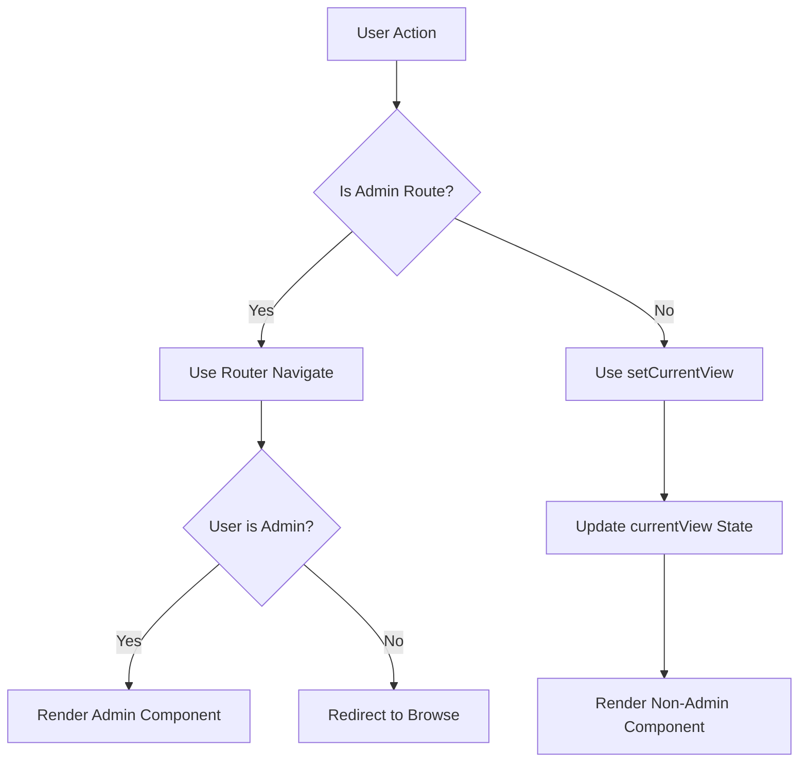

# Design Document: Admin Route Navigation

## Overview

This design refactors the admin navigation from state-based (`currentView`) to route-based navigation using React Router DOM. The implementation adds proper URL routing for admin pages (`/admin` and `/admin/health`) while maintaining the existing state-based navigation for non-admin views (browse, ai).

## Architecture

### High-Level Architecture

```
┌─────────────────────────────────────────────────────────────┐
│                      BrowserRouter                          │
├─────────────────────────────────────────────────────────────┤
│  ┌─────────────────────────────────────────────────────┐   │
│  │                    App Component                     │   │
│  │  ┌─────────────────────────────────────────────┐    │   │
│  │  │              Routes                          │    │   │
│  │  │  ┌─────────────────────────────────────┐    │    │   │
│  │  │  │ /admin/* → AdminGuard → AdminRoutes │    │    │   │
│  │  │  └─────────────────────────────────────┘    │    │   │
│  │  │  ┌─────────────────────────────────────┐    │    │   │
│  │  │  │ /* → MainContent (state-based)      │    │    │   │
│  │  │  └─────────────────────────────────────┘    │    │   │
│  │  └─────────────────────────────────────────────┘    │   │
│  └─────────────────────────────────────────────────────┘   │
└─────────────────────────────────────────────────────────────┘
```

### Navigation Flow



## Components and Interfaces

### New Components

#### AdminGuard Component

```typescript
interface AdminGuardProps {
  children: React.ReactNode;
  user: User | null;
  isLoading: boolean;
}

// Protects admin routes from unauthorized access
// Shows loading state during auth verification
// Redirects non-admin users to browse view
```

#### AdminRoutes Component

```typescript
// Nested routes for admin section
// /admin → AdminPanel
// /admin/health → AdminHealthDashboard
```

### Modified Components

#### App.tsx Changes

- Wrap application in `BrowserRouter`
- Add `Routes` component with admin route handling
- Remove 'admin' and 'health' from `currentView` type
- Add route-based rendering for admin pages

#### Navbar.tsx Changes

- Import `useNavigate` and `useLocation` from react-router-dom
- Replace `setCurrentView('admin')` with `navigate('/admin')`
- Replace `setCurrentView('health')` with `navigate('/admin/health')`
- Use `location.pathname` to determine active admin route
- Add Health button to all navbar sections (desktop, mobile, hamburger)

### Interface Definitions

```typescript
// Updated View type - admin views removed
type View = 'browse' | 'ai';

// Navbar props updated
interface NavbarProps {
  currentView: View;
  setCurrentView: (view: View) => void;
  user: User;
  onLogout: () => void;
  onOpenProfile?: () => void;
  searchQuery?: string;
  onSearchChange?: (query: string) => void;
}
```

## Data Models

No new data models required. The existing `User` type with `role` field is sufficient for authorization checks.

## Correctness Properties

*A property is a characteristic or behavior that should hold true across all valid executions of a system—essentially, a formal statement about what the system should do. Properties serve as the bridge between human-readable specifications and machine-verifiable correctness guarantees.*

### Property 1: Route Initialization Correctness

*For any* valid admin route path (`/admin` or `/admin/health`), when the application loads with that path, the corresponding admin component should be rendered for admin users.

**Validates: Requirements 1.2, 2.3, 2.4, 2.5**

### Property 2: Invalid Route Fallback

*For any* route path that does not match a defined route, the application should render the browse view as the fallback.

**Validates: Requirements 1.4**

### Property 3: Admin Route Protection

*For any* user with a role other than 'Admin', attempting to access any admin route (`/admin` or `/admin/health`) should result in a redirect to the browse view.

**Validates: Requirements 3.1, 3.2**

### Property 4: Navbar Active State Synchronization

*For any* admin route path, the navbar should visually indicate the corresponding admin section as active based on the current URL pathname.

**Validates: Requirements 4.6, 5.1, 5.2**

### Property 5: Admin Navigation Visibility

*For any* user with role 'Admin', both the Admin button and Health button should be visible in the navbar. *For any* user with a role other than 'Admin', neither admin navigation option should be visible.

**Validates: Requirements 6.1, 6.2, 6.3**

### Property 6: Authentication Persistence Across Routes

*For any* navigation between admin sub-routes, the user's authentication state should be preserved and not require re-authentication.

**Validates: Requirements 5.4**

## Error Handling

### Authentication Errors

- If user session expires during admin route access, redirect to login
- Show appropriate error message for session expiration

### Route Errors

- Invalid admin sub-routes redirect to `/admin`
- Completely invalid routes fall back to browse view

### Loading States

- AdminGuard shows loading spinner during auth verification
- Prevents flash of unauthorized content

## Testing Strategy

### Unit Tests

- Test AdminGuard component renders children for admin users
- Test AdminGuard component redirects for non-admin users
- Test AdminGuard component shows loading state during auth check
- Test navbar button click handlers call correct navigation functions
- Test navbar active state based on pathname

### Property-Based Tests

Property-based testing will use `fast-check` library with minimum 100 iterations per test.

1. **Route Initialization Property Test**
   - Generate random valid admin paths
   - Verify correct component renders for admin users

2. **Admin Route Protection Property Test**
   - Generate random non-admin user roles
   - Verify redirect occurs for all non-admin roles

3. **Navbar Visibility Property Test**
   - Generate users with various roles
   - Verify admin buttons visible only for Admin role

### Integration Tests

- Test full navigation flow from navbar click to component render
- Test browser back/forward navigation
- Test direct URL access (deep linking)
- Test logout redirect from admin routes
