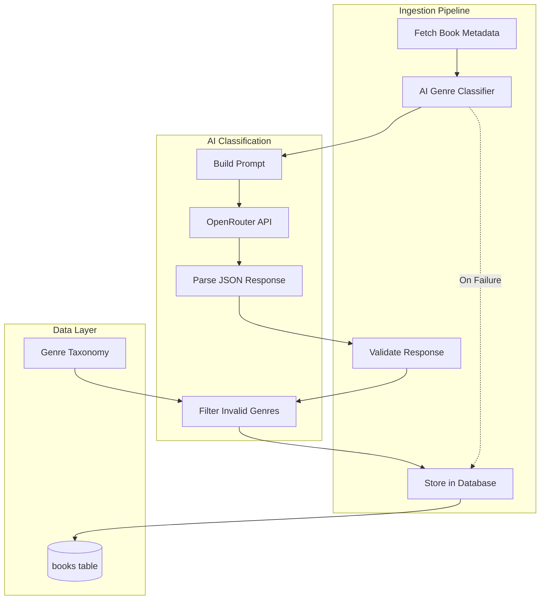

# Design Document: AI Genre Classification

## Overview

This design extends the automated public-domain book ingestion system with AI-powered genre classification. For every book imported from Internet Archive, the system automatically determines and stores genre metadata using the OpenRouter API. The classification uses semantic understanding to assign 1-3 genres and optionally 1 sub-genre from a strict controlled taxonomy.

The system is designed to be:
- **Non-blocking**: Classification failures never stop book ingestion
- **Cost-effective**: Uses lightweight models, caches results, avoids re-classification
- **Consistent**: Strict taxonomy enforcement with validation
- **Testable**: Mock responses and disable toggle for development

## Architecture



## Components and Interfaces

### 1. Genre Taxonomy (`services/ingestion/genreTaxonomy.js`)

Defines the strict controlled vocabulary for genres and sub-genres.

```javascript
/**
 * Primary genres - AI must choose 1-3 from this list only
 */
export const PRIMARY_GENRES = [
  'Philosophy',
  'Religion',
  'Theology',
  'Sacred Texts',
  'History',
  'Biography',
  'Science',
  'Mathematics',
  'Medicine',
  'Law',
  'Politics',
  'Economics',
  'Literature',
  'Poetry',
  'Drama',
  'Mythology',
  'Military & Strategy',
  'Education',
  'Linguistics',
  'Ethics',
  'Anthropology',
  'Sociology',
  'Psychology',
  'Geography',
  'Astronomy',
  'Alchemy & Esoterica',
  'Art & Architecture'
];

/**
 * Sub-genres - AI may optionally choose 1 from this list
 */
export const SUB_GENRES = [
  'Ancient',
  'Medieval',
  'Classical',
  'Early Modern',
  'Commentary',
  'Translation',
  'Manuscript',
  'Legal Code',
  'Canonical Text'
];

/**
 * Validates genres against the taxonomy
 * @param {string[]} genres - Array of genre strings
 * @returns {string[]} Filtered array of valid genres only
 */
export function validateGenres(genres) {
  // Case-insensitive matching
}

/**
 * Validates a sub-genre against the taxonomy
 * @param {string} subgenre - Sub-genre string
 * @returns {string|null} Valid sub-genre or null
 */
export function validateSubgenre(subgenre) {
  // Case-insensitive matching
}
```

### 2. Genre Classifier Service (`services/ingestion/genreClassifier.js`)

Handles AI API calls and response parsing.

```javascript
/**
 * Configuration
 */
const OPENROUTER_API_URL = 'https://openrouter.ai/api/v1/chat/completions';
const DEFAULT_MODEL = 'meta-llama/llama-3.2-3b-instruct:free'; // Free, lightweight model
const MAX_RETRIES = 2;
const TIMEOUT_MS = 10000;

/**
 * Classifies a book's genres using AI
 * @param {Object} book - Book metadata
 * @param {string} book.title - Book title
 * @param {string} book.author - Book author
 * @param {number} [book.year] - Publication year
 * @param {string} [book.description] - Book description
 * @returns {Promise<{genres: string[], subgenre: string|null} | null>}
 */
export async function classifyBook(book) {
  // Returns null on failure (non-blocking)
}

/**
 * Builds the AI prompt with taxonomy
 * @param {Object} book - Book metadata
 * @returns {string} Formatted prompt
 */
function buildPrompt(book) {
  // Includes strict taxonomy and JSON format requirements
}

/**
 * Parses and validates AI response
 * @param {string} response - Raw AI response
 * @returns {{genres: string[], subgenre: string|null} | null}
 */
function parseResponse(response) {
  // Extracts JSON, validates against taxonomy
}
```

### 3. Updated Orchestrator Integration

The orchestrator calls the classifier during book processing:

```javascript
async function processBook(book, dryRun = false) {
  // ... existing steps ...
  
  // Step 5.5: AI Genre Classification (non-blocking)
  let genres = null;
  let subgenre = null;
  
  if (!dryRun && isClassificationEnabled()) {
    try {
      const classification = await classifyBook({
        title: book.title,
        author: book.creator,
        year: year,
        description: book.description
      });
      
      if (classification) {
        genres = classification.genres;
        subgenre = classification.subgenre;
        console.log(`[Orchestrator] Classified: ${genres.join(', ')}`);
      }
    } catch (error) {
      console.warn(`[Orchestrator] Classification failed: ${error.message}`);
      // Continue without genres - non-blocking
    }
  }
  
  // Step 6: Insert book with genres
  const bookRecord = {
    // ... existing fields ...
    genres: genres,
    subgenre: subgenre
  };
}
```

## Data Models

### Database Schema (Already in `supabase_ingestion_state.sql`)

```sql
-- Add genres columns to books table
ALTER TABLE books ADD COLUMN IF NOT EXISTS genres TEXT[];
ALTER TABLE books ADD COLUMN IF NOT EXISTS subgenre TEXT;

-- Create index for genre queries
CREATE INDEX IF NOT EXISTS idx_books_genres ON books USING GIN(genres);
CREATE INDEX IF NOT EXISTS idx_books_subgenre ON books(subgenre) WHERE subgenre IS NOT NULL;
```

### TypeScript Interfaces

```typescript
interface ClassificationResult {
  genres: string[];      // 1-3 valid genres from PRIMARY_GENRES
  subgenre: string|null; // Optional, from SUB_GENRES
}

interface BookMetadata {
  title: string;
  author: string;
  year?: number;
  description?: string;
}

interface ClassifierConfig {
  enabled: boolean;
  apiKey: string;
  model: string;
  timeout: number;
  maxRetries: number;
}
```

## AI Prompt Design

The prompt is carefully structured to ensure consistent, valid responses:

```
You are a librarian classifying public-domain books. Analyze the book and assign genres.

BOOK INFORMATION:
Title: {title}
Author: {author}
Year: {year}
Description: {description}
Source: Internet Archive

ALLOWED PRIMARY GENRES (choose 1-3):
Philosophy, Religion, Theology, Sacred Texts, History, Biography, Science, 
Mathematics, Medicine, Law, Politics, Economics, Literature, Poetry, Drama, 
Mythology, Military & Strategy, Education, Linguistics, Ethics, Anthropology, 
Sociology, Psychology, Geography, Astronomy, Alchemy & Esoterica, Art & Architecture

ALLOWED SUB-GENRES (choose 0-1):
Ancient, Medieval, Classical, Early Modern, Commentary, Translation, 
Manuscript, Legal Code, Canonical Text

RULES:
1. Choose 1-3 primary genres that best describe the book
2. Optionally choose 1 sub-genre if applicable
3. Use ONLY genres from the lists above
4. Respond with ONLY valid JSON, no explanations

RESPONSE FORMAT (JSON only):
{"genres": ["Genre1", "Genre2"], "subgenre": "SubGenre"}
```

## Correctness Properties

*A property is a characteristic or behavior that should hold true across all valid executions of a system—essentially, a formal statement about what the system should do.*

### Property 1: Taxonomy Enforcement

*For any* AI response, the validated genres array SHALL contain only values from the PRIMARY_GENRES list (case-insensitive match).

**Validates: Requirements 2.1, 2.2**

### Property 2: Genre Count Bounds

*For any* valid classification result, the genres array SHALL contain between 1 and 3 elements (inclusive).

**Validates: Requirements 1.4**

### Property 3: Sub-genre Validation

*For any* AI response with a sub-genre, the validated sub-genre SHALL either be null or a value from the SUB_GENRES list (case-insensitive match).

**Validates: Requirements 2.2**

### Property 4: Non-blocking Ingestion

*For any* book ingestion where AI classification fails (timeout, API error, invalid response), the book SHALL still be inserted into the database with genres = NULL.

**Validates: Requirements 4.1, 4.2, 4.3**

### Property 5: Classification Idempotency

*For any* book that already has genres stored in the database, re-running ingestion SHALL NOT trigger a new AI classification call.

**Validates: Requirements 5.2, 5.3**

### Property 6: Response Format Validation

*For any* AI response, the parser SHALL reject responses that are not valid JSON or do not contain a "genres" array.

**Validates: Requirements 6.2, 6.5**

## Error Handling

### Error Categories

1. **API Errors**: Network failures, rate limits, authentication errors
   - Strategy: Log error, return null, continue ingestion
   - Retry: Up to 2 attempts with exponential backoff

2. **Invalid Response**: Non-JSON, missing fields, wrong format
   - Strategy: Log warning, return null, continue ingestion
   - No retry (deterministic failure)

3. **Invalid Genres**: Genres outside taxonomy
   - Strategy: Filter out invalid genres, keep valid ones
   - If all genres invalid, return null

4. **Timeout**: API call exceeds timeout
   - Strategy: Log warning, return null, continue ingestion
   - Timeout: 10 seconds

### Error Logging Format

```javascript
console.warn(`[GenreClassifier] ${errorType}: ${message}`, {
  book: { title, identifier },
  error: errorDetails
});
```

## Testing Strategy

### Property-Based Testing

Use `fast-check` library for property-based tests.

**Test Files:**
- `tests/ingestion/genreTaxonomyValidation.property.test.ts` - Properties 1, 2, 3
- `tests/ingestion/genreClassifierResilience.property.test.ts` - Property 4
- `tests/ingestion/genreClassifierIdempotency.property.test.ts` - Property 5
- `tests/ingestion/genreResponseParsing.property.test.ts` - Property 6

### Mock AI Responses

For local testing without API costs:

```javascript
// Enable mock mode via environment variable
const USE_MOCK_CLASSIFIER = process.env.MOCK_GENRE_CLASSIFIER === 'true';

// Mock responses for testing
const MOCK_RESPONSES = {
  'philosophy': { genres: ['Philosophy', 'Ethics'], subgenre: 'Ancient' },
  'religion': { genres: ['Religion', 'Theology'], subgenre: 'Canonical Text' },
  'default': { genres: ['Literature'], subgenre: null }
};
```

### Disable Toggle

```javascript
// Disable classification via environment variable
const CLASSIFICATION_ENABLED = process.env.ENABLE_GENRE_CLASSIFICATION !== 'false';

export function isClassificationEnabled() {
  return CLASSIFICATION_ENABLED && !!process.env.OPENROUTER_API_KEY;
}
```

## Configuration

### Environment Variables

```bash
# Required for AI classification
OPENROUTER_API_KEY=sk-or-v1-xxx

# Optional configuration
ENABLE_GENRE_CLASSIFICATION=true  # Set to 'false' to disable
MOCK_GENRE_CLASSIFIER=false       # Set to 'true' for testing
GENRE_CLASSIFIER_MODEL=meta-llama/llama-3.2-3b-instruct:free
GENRE_CLASSIFIER_TIMEOUT=10000
```

### Extending the Taxonomy

To add new genres or sub-genres:

1. Edit `services/ingestion/genreTaxonomy.js`
2. Add new values to `PRIMARY_GENRES` or `SUB_GENRES` arrays
3. No code changes required - validation uses these arrays at runtime
4. Update the AI prompt template if needed (in `genreClassifier.js`)

Example:
```javascript
// Adding a new primary genre
export const PRIMARY_GENRES = [
  // ... existing genres ...
  'Music',  // New genre
];
```
