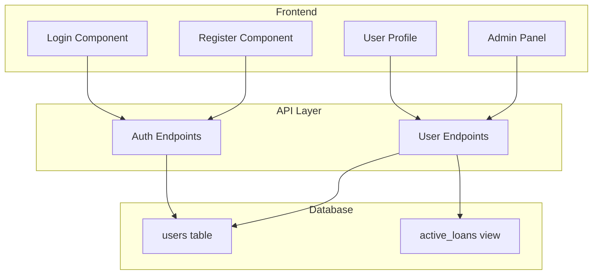

# Design Document: Global Platform Migration

## Overview

This design documents the migration of the library system from an institution-based model to a global platform model. The migration involves renaming database columns, updating role terminology, and ensuring all application layers (database, API, frontend) use consistent naming conventions.

## Architecture

The migration affects three main layers of the application:



## Components and Interfaces

### 1. Database Schema Changes

**Users Table Migration:**
| Old Column | New Column | Notes |
|------------|------------|-------|
| admission_no | username | Unique identifier for login |
| role (Student) | role (Reader) | Basic user role |
| role (Lecturer/Faculty) | role (Premium) | Enhanced privileges |
| role (Admin) | role (Admin) | No change |
| course | (deprecated) | Kept for backward compatibility |

### 2. TypeScript Interfaces

**AuthUser Interface:**
```typescript
interface AuthUser {
  id: string;
  name: string;
  username: string;  // Changed from admissionNo
  role: 'Reader' | 'Premium' | 'Admin';  // Changed from Student|Lecturer|Faculty|Admin
  avatarUrl: string;
  email?: string;
}
```

**User Interface:**
```typescript
interface User {
  id: string;
  name: string;
  avatarUrl: string;
  role: 'Reader' | 'Premium' | 'Admin';
  email?: string;
  username?: string;  // Changed from admissionNo, removed course
}
```

### 3. API Endpoints

**POST /api/auth/login**
- Request: `{ username: string, password: string, loginAs?: 'reader' | 'premium' | 'admin' }`
- Response: `{ user: AuthUser }`

**POST /api/auth/register**
- Request: `{ name: string, email: string, username: string, password: string, ... }`
- Response: `{ user: AuthUser }`

### 4. UI Components

**Login Component:**
- Input field labeled "Username" (was "Admission Number")
- Role selector with Reader/Premium/Admin options (was Student/Lecturer/Staff)

**Register Component:**
- Input field for username (was admission_no)
- No course selection field

**User Profile Component:**
- Displays username (was admission_no)
- No course field displayed

**Admin Panel:**
- User table shows username column (was admission_no)
- Role filter uses Reader/Premium/Admin values

## Data Models

### Role Mapping

```
Institution-Based → Global Platform
─────────────────────────────────────
Student          → Reader
Lecturer         → Premium
Faculty          → Premium
Admin            → Admin
```

### Session Storage

User data stored in sessionStorage under key `drizaikn_user`:
```json
{
  "id": "uuid",
  "name": "User Name",
  "username": "chosen_username",
  "role": "Reader",
  "avatarUrl": "url",
  "email": "email@example.com"
}
```

## Correctness Properties

*A property is a characteristic or behavior that should hold true across all valid executions of a system—essentially, a formal statement about what the system should do. Properties serve as the bridge between human-readable specifications and machine-verifiable correctness guarantees.*


### Property 1: Username Uniqueness

*For any* two users in the system, their usernames SHALL be distinct. Attempting to register with an existing username SHALL result in a rejection.

**Validates: Requirements 1.5**

### Property 2: Default Role Assignment

*For any* new user registration without explicit role specification, the system SHALL assign the Reader role.

**Validates: Requirements 2.2**

### Property 3: Migration Idempotency

*For any* database state, running the migration script multiple times SHALL produce the same result as running it once, without errors.

**Validates: Requirements 3.5**

### Property 4: Auth API Username Acceptance

*For any* valid username string, the login and registration API endpoints SHALL accept it in the request body and process the request correctly.

**Validates: Requirements 1.1, 1.2, 5.1, 5.2**

### Property 5: API Response Username Inclusion

*For any* API response that returns user data, the response SHALL include the username field with the correct value.

**Validates: Requirements 5.3**

### Property 6: Role Validation

*For any* API request that includes a role value, the system SHALL only accept Reader, Premium, or Admin. Invalid role values SHALL be rejected with an error.

**Validates: Requirements 5.4**

## Error Handling

| Scenario | Error Response |
|----------|----------------|
| Duplicate username registration | "Username already exists" |
| Invalid role value | "Invalid role. Must be Reader, Premium, or Admin" |
| Login with non-existent username | "Invalid credentials" |
| Migration on already-migrated DB | Graceful skip with notice |

## Testing Strategy

### Unit Tests
- Verify TypeScript interfaces compile correctly with new field names
- Test role type guards accept only valid role values
- Test session storage serialization/deserialization

### Integration Tests
- Test login flow with username field
- Test registration flow with username field
- Test admin panel displays correct role labels
- Test user profile shows username

### Property-Based Tests
- **Property 1**: Generate random usernames and verify uniqueness constraint
- **Property 2**: Register multiple users and verify all get Reader role
- **Property 4**: Generate valid username strings and verify API acceptance
- **Property 6**: Generate invalid role strings and verify rejection

### Migration Tests
- Run migration on fresh database
- Run migration on already-migrated database (idempotency)
- Verify role conversions (Student→Reader, Lecturer→Premium)
