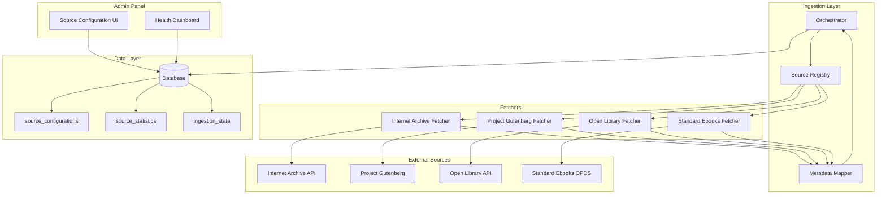
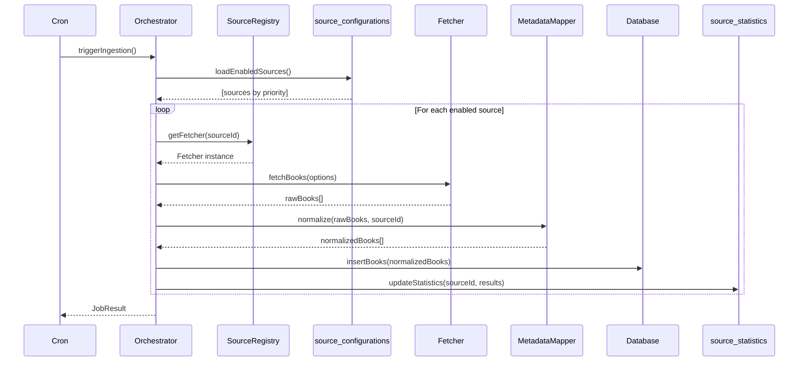

# Design Document: Multi-Source Ingestion

## Overview

This design extends the digital library's ingestion system to support multiple public domain book sources through a pluggable fetcher architecture. The system introduces a Source Registry that manages fetcher implementations, a database-backed configuration system for runtime source management, and enhanced monitoring capabilities in the admin health dashboard.

The architecture follows the Strategy pattern, where each book source is implemented as a Fetcher that conforms to a common interface. The existing Internet Archive fetcher becomes one of several pluggable sources, maintaining full backward compatibility while enabling expansion to Project Gutenberg, Open Library, and Standard Ebooks.

## Architecture



### Data Flow



## Components and Interfaces

### 1. Fetcher Interface

All source fetchers must implement this interface:

```javascript
/**
 * @interface Fetcher
 * Base interface for all book source fetchers
 */
interface Fetcher {
  /**
   * Unique identifier for this source
   * @returns {string} Source ID (e.g., 'internet_archive', 'project_gutenberg')
   */
  getSourceId(): string;
  
  /**
   * Human-readable metadata about this source
   * @returns {SourceMetadata}
   */
  getSourceMetadata(): SourceMetadata;
  
  /**
   * Fetch books from the source
   * @param {FetchOptions} options - Pagination and filtering options
   * @returns {Promise<RawBook[]>} Array of raw book data from source
   */
  fetchBooks(options: FetchOptions): Promise<RawBook[]>;
  
  /**
   * Parse a single book document from source-specific format
   * @param {object} doc - Raw document from source API
   * @returns {RawBook} Parsed book in source-specific format
   */
  parseBookDocument(doc: object): RawBook;
  
  /**
   * Construct download URL for a book
   * @param {string} identifier - Source-specific book identifier
   * @param {string} format - Preferred format (pdf, epub, txt)
   * @returns {string|null} Download URL or null if unavailable
   */
  getDownloadUrl(identifier: string, format?: string): string | null;
}

interface SourceMetadata {
  sourceId: string;
  displayName: string;
  description: string;
  website: string;
  supportedFormats: string[];
  defaultRateLimitMs: number;
  defaultBatchSize: number;
}

interface FetchOptions {
  batchSize?: number;
  page?: number;
  language?: string;
  format?: string;
  delayMs?: number;
}

interface RawBook {
  identifier: string;
  title: string;
  creator: string | string[];
  date: string | null;
  language: string | null;
  description: string | null;
  downloadUrl?: string;
  coverUrl?: string;
  formats?: string[];
  sourceSpecific?: object;
}
```

### 2. Source Registry

```javascript
/**
 * @class SourceRegistry
 * Central registry for managing fetcher implementations
 */
class SourceRegistry {
  private fetchers: Map<string, Fetcher>;
  private configurations: Map<string, SourceConfiguration>;
  
  /**
   * Register a fetcher implementation
   * @param {Fetcher} fetcher - Fetcher instance to register
   * @throws {Error} If fetcher doesn't implement required interface
   */
  register(fetcher: Fetcher): void;
  
  /**
   * Get a fetcher by source ID
   * @param {string} sourceId - Source identifier
   * @returns {Fetcher|null} Fetcher instance or null if not found
   */
  getFetcher(sourceId: string): Fetcher | null;
  
  /**
   * Get all registered fetchers
   * @returns {Fetcher[]} Array of all registered fetchers
   */
  getAllFetchers(): Fetcher[];
  
  /**
   * Get enabled fetchers sorted by priority
   * @returns {Promise<Fetcher[]>} Enabled fetchers in priority order
   */
  getEnabledFetchers(): Promise<Fetcher[]>;
  
  /**
   * Load configurations from database
   * @returns {Promise<void>}
   */
  loadConfigurations(): Promise<void>;
  
  /**
   * Validate that a fetcher implements required interface
   * @param {Fetcher} fetcher - Fetcher to validate
   * @returns {boolean} True if valid
   */
  validateFetcher(fetcher: Fetcher): boolean;
}
```

### 3. Metadata Mapper

```javascript
/**
 * @class MetadataMapper
 * Normalizes book metadata from various sources to unified schema
 */
class MetadataMapper {
  /**
   * Normalize raw book data to unified schema
   * @param {RawBook} rawBook - Source-specific book data
   * @param {string} sourceId - Source identifier
   * @returns {NormalizedBook} Unified book schema
   */
  normalize(rawBook: RawBook, sourceId: string): NormalizedBook;
  
  /**
   * Extract year from various date formats
   * @param {string|null} dateStr - Date string in various formats
   * @returns {number|null} Four-digit year or null
   */
  extractYear(dateStr: string | null): number | null;
  
  /**
   * Normalize author field to string
   * @param {string|string[]} creator - Author(s) in various formats
   * @returns {string} Comma-separated author string
   */
  normalizeAuthor(creator: string | string[]): string;
  
  /**
   * Apply source-specific transformations
   * @param {RawBook} rawBook - Raw book data
   * @param {string} sourceId - Source identifier
   * @returns {object} Transformed fields
   */
  applySourceTransforms(rawBook: RawBook, sourceId: string): object;
}

interface NormalizedBook {
  title: string;
  author: string;
  year: number | null;
  language: string | null;
  description: string | null;
  source: string;
  source_identifier: string;
  pdf_url?: string;
  cover_url?: string;
}
```

### 4. Source Configuration Service

```javascript
/**
 * @class SourceConfigurationService
 * Manages source configurations in the database
 */
class SourceConfigurationService {
  /**
   * Get configuration for a source
   * @param {string} sourceId - Source identifier
   * @returns {Promise<SourceConfiguration|null>}
   */
  getConfiguration(sourceId: string): Promise<SourceConfiguration | null>;
  
  /**
   * Get all configurations
   * @returns {Promise<SourceConfiguration[]>}
   */
  getAllConfigurations(): Promise<SourceConfiguration[]>;
  
  /**
   * Get enabled configurations sorted by priority
   * @returns {Promise<SourceConfiguration[]>}
   */
  getEnabledConfigurations(): Promise<SourceConfiguration[]>;
  
  /**
   * Update configuration for a source
   * @param {string} sourceId - Source identifier
   * @param {Partial<SourceConfiguration>} updates - Fields to update
   * @returns {Promise<SourceConfiguration>}
   */
  updateConfiguration(sourceId: string, updates: Partial<SourceConfiguration>): Promise<SourceConfiguration>;
  
  /**
   * Enable or disable a source
   * @param {string} sourceId - Source identifier
   * @param {boolean} enabled - New enabled state
   * @returns {Promise<SourceConfiguration>}
   */
  setEnabled(sourceId: string, enabled: boolean): Promise<SourceConfiguration>;
  
  /**
   * Create default configuration for a new source
   * @param {SourceMetadata} metadata - Source metadata
   * @returns {Promise<SourceConfiguration>}
   */
  createDefaultConfiguration(metadata: SourceMetadata): Promise<SourceConfiguration>;
}

interface SourceConfiguration {
  source_id: string;
  display_name: string;
  enabled: boolean;
  priority: number;
  rate_limit_ms: number;
  batch_size: number;
  source_specific_config: object;
  created_at: string;
  updated_at: string;
}
```

### 5. Source Statistics Service

```javascript
/**
 * @class SourceStatisticsService
 * Tracks and retrieves per-source ingestion statistics
 */
class SourceStatisticsService {
  /**
   * Get statistics for a source
   * @param {string} sourceId - Source identifier
   * @returns {Promise<SourceStatistics|null>}
   */
  getStatistics(sourceId: string): Promise<SourceStatistics | null>;
  
  /**
   * Get statistics for all sources
   * @returns {Promise<SourceStatistics[]>}
   */
  getAllStatistics(): Promise<SourceStatistics[]>;
  
  /**
   * Update statistics after an ingestion run
   * @param {string} sourceId - Source identifier
   * @param {RunResult} result - Results from the run
   * @returns {Promise<SourceStatistics>}
   */
  updateStatistics(sourceId: string, result: RunResult): Promise<SourceStatistics>;
  
  /**
   * Get trend data for a source
   * @param {string} sourceId - Source identifier
   * @param {number} days - Number of days to include
   * @returns {Promise<DailyStatistics[]>}
   */
  getTrend(sourceId: string, days: number): Promise<DailyStatistics[]>;
  
  /**
   * Calculate health status for a source
   * @param {SourceStatistics} stats - Current statistics
   * @returns {'healthy' | 'warning' | 'failed'}
   */
  calculateHealthStatus(stats: SourceStatistics): 'healthy' | 'warning' | 'failed';
}

interface SourceStatistics {
  source_id: string;
  total_ingested: number;
  success_count: number;
  failure_count: number;
  last_run_at: string | null;
  last_success_at: string | null;
  average_processing_time_ms: number;
  error_count_24h: number;
  updated_at: string;
}

interface DailyStatistics {
  date: string;
  ingested: number;
  succeeded: number;
  failed: number;
}

interface RunResult {
  processed: number;
  added: number;
  failed: number;
  processingTimeMs: number;
}
```

### 6. Enhanced Orchestrator

The existing orchestrator will be extended to support multi-source ingestion:

```javascript
/**
 * Extended orchestrator methods for multi-source support
 */
class Orchestrator {
  /**
   * Run ingestion for all enabled sources
   * @param {JobOptions} options - Job configuration
   * @returns {Promise<MultiSourceJobResult>}
   */
  runMultiSourceIngestion(options: JobOptions): Promise<MultiSourceJobResult>;
  
  /**
   * Run ingestion for a specific source
   * @param {string} sourceId - Source to process
   * @param {JobOptions} options - Job configuration
   * @returns {Promise<JobResult>}
   */
  runSourceIngestion(sourceId: string, options: JobOptions): Promise<JobResult>;
  
  /**
   * Process books from a specific fetcher
   * @param {Fetcher} fetcher - Fetcher instance
   * @param {SourceConfiguration} config - Source configuration
   * @param {JobOptions} options - Job options
   * @returns {Promise<JobResult>}
   */
  processSource(fetcher: Fetcher, config: SourceConfiguration, options: JobOptions): Promise<JobResult>;
}

interface MultiSourceJobResult {
  jobId: string;
  status: 'completed' | 'partial' | 'failed';
  startedAt: Date;
  completedAt: Date;
  sourceResults: Map<string, JobResult>;
  totalProcessed: number;
  totalAdded: number;
  totalFailed: number;
}
```

## Data Models

### Database Schema

```sql
-- Source configurations table
CREATE TABLE source_configurations (
  source_id TEXT PRIMARY KEY,
  display_name TEXT NOT NULL,
  enabled BOOLEAN DEFAULT false,
  priority INTEGER DEFAULT 100,
  rate_limit_ms INTEGER DEFAULT 1500,
  batch_size INTEGER DEFAULT 30,
  source_specific_config JSONB DEFAULT '{}',
  created_at TIMESTAMP WITH TIME ZONE DEFAULT NOW(),
  updated_at TIMESTAMP WITH TIME ZONE DEFAULT NOW()
);

-- Source statistics table
CREATE TABLE source_statistics (
  source_id TEXT PRIMARY KEY REFERENCES source_configurations(source_id),
  total_ingested INTEGER DEFAULT 0,
  success_count INTEGER DEFAULT 0,
  failure_count INTEGER DEFAULT 0,
  last_run_at TIMESTAMP WITH TIME ZONE,
  last_success_at TIMESTAMP WITH TIME ZONE,
  average_processing_time_ms INTEGER DEFAULT 0,
  created_at TIMESTAMP WITH TIME ZONE DEFAULT NOW(),
  updated_at TIMESTAMP WITH TIME ZONE DEFAULT NOW()
);

-- Daily statistics for trend tracking
CREATE TABLE source_daily_statistics (
  id UUID PRIMARY KEY DEFAULT uuid_generate_v4(),
  source_id TEXT REFERENCES source_configurations(source_id),
  date DATE NOT NULL,
  ingested INTEGER DEFAULT 0,
  succeeded INTEGER DEFAULT 0,
  failed INTEGER DEFAULT 0,
  processing_time_ms INTEGER DEFAULT 0,
  created_at TIMESTAMP WITH TIME ZONE DEFAULT NOW(),
  UNIQUE(source_id, date)
);

-- Extend existing ingestion_state for multi-source
ALTER TABLE ingestion_state ADD COLUMN IF NOT EXISTS source_config_id TEXT REFERENCES source_configurations(source_id);

-- Index for efficient queries
CREATE INDEX idx_source_daily_stats_source_date ON source_daily_statistics(source_id, date DESC);
CREATE INDEX idx_source_configs_enabled_priority ON source_configurations(enabled, priority) WHERE enabled = true;
```

### TypeScript Types

```typescript
// Source configuration type
interface SourceConfiguration {
  source_id: string;
  display_name: string;
  enabled: boolean;
  priority: number;
  rate_limit_ms: number;
  batch_size: number;
  source_specific_config: Record<string, unknown>;
  created_at: string;
  updated_at: string;
}

// Source statistics type
interface SourceStatistics {
  source_id: string;
  total_ingested: number;
  success_count: number;
  failure_count: number;
  last_run_at: string | null;
  last_success_at: string | null;
  average_processing_time_ms: number;
  created_at: string;
  updated_at: string;
}

// Daily statistics type
interface SourceDailyStatistics {
  id: string;
  source_id: string;
  date: string;
  ingested: number;
  succeeded: number;
  failed: number;
  processing_time_ms: number;
  created_at: string;
}

// Multi-source job result
interface MultiSourceJobResult {
  jobId: string;
  status: 'completed' | 'partial' | 'failed';
  startedAt: string;
  completedAt: string;
  sourceResults: Record<string, SourceJobResult>;
  totalProcessed: number;
  totalAdded: number;
  totalFailed: number;
}

interface SourceJobResult {
  sourceId: string;
  status: 'completed' | 'partial' | 'failed' | 'skipped';
  processed: number;
  added: number;
  skipped: number;
  failed: number;
  errors: Array<{ identifier: string; error: string; timestamp: string }>;
  nextPage: number | null;
}
```


## Correctness Properties

*A property is a characteristic or behavior that should hold true across all valid executions of a system—essentially, a formal statement about what the system should do. Properties serve as the bridge between human-readable specifications and machine-verifiable correctness guarantees.*

### Property 1: Registry Fetcher Retrieval

*For any* fetcher that has been successfully registered with the Source Registry, requesting that fetcher by its source ID shall return the same fetcher instance.

**Validates: Requirements 1.1, 1.4**

### Property 2: Fetcher Interface Validation

*For any* object passed to the Source Registry's register method, if the object does not implement all required interface methods (getSourceId, getSourceMetadata, fetchBooks, parseBookDocument, getDownloadUrl), the registration shall be rejected with an error.

**Validates: Requirements 1.2**

### Property 3: Failed Fetcher Exclusion

*For any* fetcher that throws an error during registration, that fetcher shall not appear in the list of available fetchers returned by getAllFetchers().

**Validates: Requirements 1.5**

### Property 4: Configuration Persistence Round-Trip

*For any* source configuration update (enabled state, priority, rate_limit_ms, batch_size), saving the configuration and then reading it back shall return the same values that were saved.

**Validates: Requirements 2.2**

### Property 5: Default Configuration Creation

*For any* fetcher registered with the Source Registry that does not have an existing configuration in the database, a default configuration shall be created with enabled=false and the fetcher's default values.

**Validates: Requirements 2.4**

### Property 6: JSON Validation on Config Update

*For any* source_specific_config update, if the provided value is not valid JSON or does not match the expected schema for that source type, the update shall be rejected and the original configuration preserved.

**Validates: Requirements 2.5**

### Property 7: Required Config Validation on Enable

*For any* source that is being enabled, if the source's required configuration fields are missing or invalid, the enable operation shall fail and the source shall remain disabled.

**Validates: Requirements 3.3**

### Property 8: Metadata Normalization Completeness

*For any* raw book returned by any fetcher, the Metadata Mapper shall produce a normalized book object containing all required fields (title, author, year, language, description, source, source_identifier) with appropriate types (strings, numbers, or null).

**Validates: Requirements 4.1, 4.2**

### Property 9: Author Array Joining

*For any* raw book where the creator field is an array of strings, the normalized author field shall be a single string containing all authors joined by ", " (comma-space).

**Validates: Requirements 4.3**

### Property 10: Year Extraction from Dates

*For any* date string containing a four-digit year (1000-2999), the extractYear function shall return that year as a number. For date strings without a valid year, it shall return null.

**Validates: Requirements 4.4**

### Property 11: Statistics Update After Job

*For any* completed ingestion job for a source, the source's statistics shall be updated such that total_ingested increases by the number of books added, success_count increases by successful operations, and failure_count increases by failed operations.

**Validates: Requirements 5.2**

### Property 12: Success Rate Calculation

*For any* source statistics where total_processed > 0, the calculated success_rate shall equal (success_count / total_processed * 100), rounded to two decimal places.

**Validates: Requirements 5.5**

### Property 13: Source Ordering by Priority

*For any* set of enabled sources, getEnabledFetchers() shall return them sorted by priority (ascending), with sources of equal priority sorted alphabetically by source_id.

**Validates: Requirements 6.2, 6.3**

### Property 14: Disabled Source Exclusion

*For any* source with enabled=false, that source shall not appear in the list returned by getEnabledFetchers(), regardless of its priority value.

**Validates: Requirements 6.5**

### Property 15: Rate Limit Enforcement

*For any* source with a configured rate_limit_ms, the time between consecutive API requests to that source shall be at least rate_limit_ms milliseconds.

**Validates: Requirements 8.2**

### Property 16: Default Rate Limit Application

*For any* source where rate_limit_ms is not configured (null or undefined), the effective rate limit applied shall be 1500 milliseconds.

**Validates: Requirements 8.5**

### Property 17: Health Status Calculation

*For any* source statistics:
- If last_run_status is 'failed', health status shall be 'failed'
- Else if error_count_24h > 5, health status shall be 'warning'
- Else if last_success_at is more than 48 hours ago, health status shall be 'warning'
- Otherwise, health status shall be 'healthy'

**Validates: Requirements 12.2, 12.3, 12.4**

### Property 18: Enabled State Affects Inclusion

*For any* source, if enabled is set to true, the source shall appear in getEnabledFetchers(). If enabled is set to false, the source shall not appear in getEnabledFetchers().

**Validates: Requirements 13.1, 13.2**

## Error Handling

### Fetcher Registration Errors

| Error Condition | Handling Strategy | User Feedback |
|----------------|-------------------|---------------|
| Fetcher missing required methods | Reject registration, log error | Admin sees source as "unavailable" with error message |
| Fetcher throws during getSourceMetadata() | Exclude from registry, log error | Source not shown in admin panel |
| Duplicate source_id registration | Reject second registration, log warning | N/A (internal error) |

### Configuration Errors

| Error Condition | Handling Strategy | User Feedback |
|----------------|-------------------|---------------|
| Invalid JSON in source_specific_config | Reject update, preserve original | "Invalid configuration format" error message |
| Missing required config on enable | Reject enable, keep disabled | "Missing required configuration: [field]" |
| Database connection failure | Retry with exponential backoff, fall back to defaults | "Configuration temporarily unavailable" |

### Ingestion Errors

| Error Condition | Handling Strategy | User Feedback |
|----------------|-------------------|---------------|
| Source API unavailable | Skip source, continue with others, log error | Source shows "warning" status in dashboard |
| Rate limit (HTTP 429) | Wait for Retry-After, then retry once | Logged in ingestion logs |
| Invalid book metadata | Skip book, log error, continue | Increments failure count in statistics |
| PDF download failure | Skip book, log error, continue | Increments failure count in statistics |
| All sources fail | Mark job as failed, send alert | Dashboard shows "failed" overall status |

### Database Errors

| Error Condition | Handling Strategy | User Feedback |
|----------------|-------------------|---------------|
| Statistics update failure | Log error, continue ingestion | Statistics may be stale (logged) |
| Configuration read failure | Use cached config or defaults | "Using cached configuration" warning |
| State persistence failure | Log error, continue (may re-process books) | Logged in error summary |

## Testing Strategy

### Unit Tests

Unit tests focus on specific examples, edge cases, and error conditions:

1. **Source Registry**
   - Register valid fetcher successfully
   - Reject fetcher missing required methods
   - Handle duplicate registration attempts
   - Return null for unknown source ID

2. **Metadata Mapper**
   - Normalize book with all fields present
   - Handle missing optional fields
   - Join array of authors correctly
   - Extract year from various date formats (YYYY, YYYY-MM-DD, "circa 1920", etc.)
   - Handle null/undefined date gracefully

3. **Source Configuration Service**
   - Create default configuration for new source
   - Update configuration fields
   - Validate JSON structure
   - Handle database errors gracefully

4. **Source Statistics Service**
   - Calculate success rate correctly
   - Handle division by zero (no processed books)
   - Calculate health status for various scenarios
   - Aggregate daily statistics

5. **Orchestrator**
   - Process sources in priority order
   - Skip disabled sources
   - Handle source failure gracefully
   - Respect rate limits

### Property-Based Tests

Property-based tests validate universal properties across randomly generated inputs. Each test runs minimum 100 iterations.

**Testing Framework**: fast-check (JavaScript property-based testing library)

| Property | Test Description | Generator Strategy |
|----------|------------------|-------------------|
| Property 1 | Registry retrieval | Generate random fetcher mocks, register, verify retrieval |
| Property 2 | Interface validation | Generate objects with random subsets of required methods |
| Property 4 | Config round-trip | Generate random config values, save/load, compare |
| Property 8 | Metadata normalization | Generate raw books with random field combinations |
| Property 9 | Author joining | Generate arrays of 1-10 random author strings |
| Property 10 | Year extraction | Generate date strings in various formats |
| Property 12 | Success rate | Generate random success/total counts |
| Property 13 | Priority ordering | Generate lists of sources with random priorities |
| Property 17 | Health status | Generate statistics with various failure/timing scenarios |
| Property 18 | Enabled state | Generate sources with random enabled states |

### Integration Tests

Integration tests verify end-to-end behavior:

1. **Multi-source ingestion flow**
   - Enable multiple sources, run ingestion, verify all processed
   - Disable source mid-run, verify graceful handling

2. **Configuration persistence**
   - Update config via API, verify persisted to database
   - Restart service, verify config loaded correctly

3. **Statistics tracking**
   - Run ingestion, verify statistics updated
   - Query trend data, verify daily aggregation

4. **Health dashboard integration**
   - Simulate failures, verify dashboard reflects status
   - Verify per-source statistics displayed correctly

### Test Configuration

```javascript
// Property test configuration
const propertyTestConfig = {
  numRuns: 100,
  seed: Date.now(),
  verbose: true,
  endOnFailure: true
};

// Test tagging format
// Feature: multi-source-ingestion, Property N: [property description]
```

