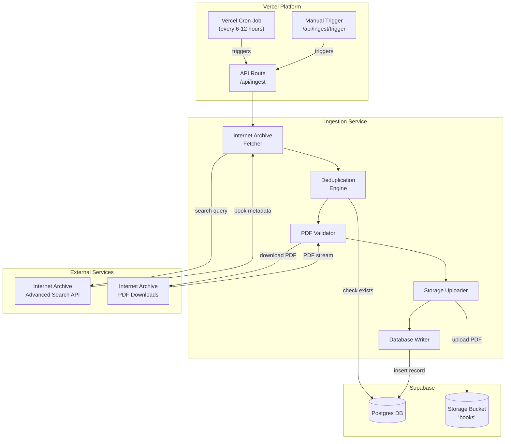

# Design Document: Public Domain Book Ingestion

## Overview

This design describes a fully automated background ingestion system that continuously imports public-domain PDF books from Internet Archive into the Drizaikn Digital Library System. The system runs on Vercel Cron Jobs, stores PDFs in Supabase Storage, and inserts metadata into Supabase Postgres.

The architecture follows a modular approach with clear separation between:
- **API Layer**: Vercel serverless functions handling cron triggers and manual API calls
- **Ingestion Service**: Core business logic for fetching, validating, and storing books
- **Data Layer**: Supabase Postgres for metadata and Supabase Storage for PDF files

## Architecture



## Components and Interfaces

### 1. Internet Archive Fetcher (`services/ingestion/internetArchiveFetcher.js`)

Responsible for querying the Internet Archive Advanced Search API.

```javascript
/**
 * Fetches public-domain book metadata from Internet Archive
 * @param {Object} options - Search options
 * @param {number} options.batchSize - Number of books to fetch (default: 30)
 * @param {number} options.page - Page number for pagination (default: 1)
 * @returns {Promise<BookMetadata[]>} Array of book metadata objects
 */
async function fetchBooks(options) {
  // Returns: { identifier, title, creator, date, language, description }
}

/**
 * Constructs the PDF download URL for a given Internet Archive identifier
 * @param {string} identifier - Internet Archive item identifier
 * @returns {string} Direct PDF download URL
 */
function getPdfUrl(identifier) {
  // Returns: https://archive.org/download/{identifier}/{identifier}.pdf
}
```

**Internet Archive API Query Parameters:**
- `mediatype:texts` - Only text/book items
- `format:pdf` - Must have PDF format available
- `date:[* TO 1927]` - Published before 1928 (public domain)
- `fl[]` - Fields: identifier, title, creator, date, language, description
- `output=json` - JSON response format
- `rows={batchSize}` - Limit results
- `page={page}` - Pagination

### 2. Deduplication Engine (`services/ingestion/deduplicationEngine.js`)

Prevents duplicate book entries using source_identifier.

```javascript
/**
 * Checks if a book already exists in the database
 * @param {string} sourceIdentifier - Internet Archive identifier
 * @returns {Promise<boolean>} True if book exists
 */
async function bookExists(sourceIdentifier) {
  // Query: SELECT 1 FROM books WHERE source_identifier = $1
}

/**
 * Filters out books that already exist in the database
 * @param {BookMetadata[]} books - Array of book metadata
 * @returns {Promise<BookMetadata[]>} Filtered array of new books
 */
async function filterNewBooks(books) {
  // Batch check for efficiency
}
```

### 3. PDF Validator (`services/ingestion/pdfValidator.js`)

Downloads and validates PDF files before upload.

```javascript
/**
 * Downloads a PDF and validates it
 * @param {string} url - PDF download URL
 * @returns {Promise<{buffer: Buffer, size: number} | null>} PDF data or null if invalid
 */
async function downloadAndValidate(url) {
  // Stream download, validate non-empty, check PDF header
}

/**
 * Sanitizes a filename for safe storage
 * @param {string} identifier - Original identifier
 * @returns {string} Sanitized filename
 */
function sanitizeFilename(identifier) {
  // Remove special characters, limit length
}
```

### 4. Storage Uploader (`services/ingestion/storageUploader.js`)

Uploads PDFs to Supabase Storage.

```javascript
/**
 * Uploads a PDF to Supabase Storage
 * @param {Buffer} pdfBuffer - PDF file content
 * @param {string} filename - Sanitized filename
 * @returns {Promise<string>} Public URL of uploaded file
 */
async function uploadPdf(pdfBuffer, filename) {
  // Upload to 'books' bucket at path: internet_archive/{filename}.pdf
  // Returns public URL
}

/**
 * Checks if a file already exists in storage
 * @param {string} path - Storage path
 * @returns {Promise<boolean>} True if file exists
 */
async function fileExists(path) {
  // Check storage to avoid overwrites
}
```

### 5. Database Writer (`services/ingestion/databaseWriter.js`)

Inserts book records into Supabase Postgres.

```javascript
/**
 * Inserts a book record into the database
 * @param {BookRecord} book - Book data to insert
 * @returns {Promise<{success: boolean, id?: string, error?: string}>}
 */
async function insertBook(book) {
  // INSERT INTO books (title, author, year, language, source, source_identifier, pdf_url, ...)
}

/**
 * Logs ingestion job results
 * @param {JobResult} result - Job execution results
 * @returns {Promise<void>}
 */
async function logJobResult(result) {
  // INSERT INTO ingestion_logs (...)
}
```

### 6. Ingestion Orchestrator (`services/ingestion/orchestrator.js`)

Coordinates the entire ingestion workflow.

```javascript
/**
 * Runs a complete ingestion job
 * @param {Object} options - Job options
 * @param {number} options.batchSize - Books per batch (default: 30)
 * @param {boolean} options.dryRun - If true, log only without side effects
 * @returns {Promise<JobResult>} Job execution summary
 */
async function runIngestionJob(options) {
  // 1. Fetch books from Internet Archive
  // 2. Filter duplicates
  // 3. For each new book:
  //    a. Download and validate PDF
  //    b. Upload to storage
  //    c. Insert database record
  // 4. Log results
  // 5. Return summary
}
```

### 7. API Routes

**Cron Endpoint** (`api/ingest/index.js`):
```javascript
// GET /api/ingest - Triggered by Vercel Cron
// Runs automated ingestion job
```

**Manual Trigger Endpoint** (`api/ingest/trigger.js`):
```javascript
// POST /api/ingest/trigger
// Body: { batchSize?: number, dryRun?: boolean }
// Returns: { jobId, status, processed, added, skipped, failed }
```

## Data Models

### Database Schema Changes

Add new columns to existing `books` table (nullable to preserve manual upload compatibility):

```sql
-- Add ingestion tracking columns to books table
ALTER TABLE books ADD COLUMN IF NOT EXISTS source TEXT;
ALTER TABLE books ADD COLUMN IF NOT EXISTS source_identifier TEXT;
ALTER TABLE books ADD COLUMN IF NOT EXISTS pdf_url TEXT;
ALTER TABLE books ADD COLUMN IF NOT EXISTS language TEXT;

-- Create unique index for deduplication (only for non-null values)
CREATE UNIQUE INDEX IF NOT EXISTS idx_books_source_identifier 
ON books(source_identifier) 
WHERE source_identifier IS NOT NULL;

-- Create ingestion logs table for job tracking
CREATE TABLE IF NOT EXISTS ingestion_logs (
  id UUID PRIMARY KEY DEFAULT uuid_generate_v4(),
  job_type TEXT NOT NULL DEFAULT 'scheduled',
  started_at TIMESTAMP WITH TIME ZONE DEFAULT NOW(),
  completed_at TIMESTAMP WITH TIME ZONE,
  status TEXT NOT NULL DEFAULT 'running',
  books_processed INT DEFAULT 0,
  books_added INT DEFAULT 0,
  books_skipped INT DEFAULT 0,
  books_failed INT DEFAULT 0,
  error_details JSONB,
  created_at TIMESTAMP WITH TIME ZONE DEFAULT NOW()
);

-- Index for querying recent jobs
CREATE INDEX IF NOT EXISTS idx_ingestion_logs_started 
ON ingestion_logs(started_at DESC);
```

### TypeScript Interfaces

```typescript
interface BookMetadata {
  identifier: string;      // Internet Archive identifier
  title: string;
  creator: string;         // Author
  date?: string;           // Publication date
  language?: string;
  description?: string;
}

interface BookRecord {
  title: string;
  author: string;
  year?: number;
  language?: string;
  source: string;          // 'internet_archive'
  source_identifier: string;
  pdf_url: string;
  description?: string;
  cover_url?: string;
  category_id?: string;
  total_copies: number;    // Default: 1
  copies_available: number; // Default: 1
  popularity: number;      // Default: 0
}

interface JobResult {
  jobId: string;
  status: 'completed' | 'failed' | 'partial';
  startedAt: Date;
  completedAt: Date;
  processed: number;
  added: number;
  skipped: number;
  failed: number;
  errors: Array<{ identifier: string; error: string }>;
}

interface IngestionOptions {
  batchSize?: number;      // Default: 30
  dryRun?: boolean;        // Default: false
  page?: number;           // For pagination
}
```

### Vercel Cron Configuration

Add to `vercel.json`:

```json
{
  "crons": [
    {
      "path": "/api/ingest",
      "schedule": "0 */6 * * *"
    }
  ]
}
```

This runs the ingestion job every 6 hours (at minute 0 of hours 0, 6, 12, 18).


## Correctness Properties

*A property is a characteristic or behavior that should hold true across all valid executions of a system—essentially, a formal statement about what the system should do. Properties serve as the bridge between human-readable specifications and machine-verifiable correctness guarantees.*

Based on the acceptance criteria analysis, the following correctness properties must be validated through property-based testing:

### Property 1: PDF URL Construction

*For any* valid Internet Archive identifier, the constructed PDF URL SHALL follow the pattern `https://archive.org/download/{identifier}/{identifier}.pdf`.

**Validates: Requirements 1.4**

### Property 2: Filename Sanitization Produces Safe Paths

*For any* input string (identifier), the sanitized filename SHALL:
- Contain only alphanumeric characters, hyphens, and underscores
- Not contain path traversal sequences (../, ..\)
- Not exceed 200 characters in length
- Produce a valid storage path when combined with the bucket structure

**Validates: Requirements 4.4, 5.2**

### Property 3: Idempotency - Re-running Produces No Duplicates

*For any* set of books, running the ingestion job twice with the same input SHALL result in:
- The same number of books in the database after both runs
- No duplicate source_identifier values
- The second run reporting all books as "skipped"

**Validates: Requirements 3.1, 3.2, 3.4**

### Property 4: Dry Run Has No Side Effects

*For any* ingestion job run with `dryRun: true`:
- The database book count SHALL remain unchanged
- The storage bucket SHALL have no new files
- The job result SHALL report books as "would be added" without actual additions

**Validates: Requirements 9.3**

### Property 5: Job Result Contains All Required Counts

*For any* completed ingestion job, the result object SHALL contain:
- `processed`: total books attempted (processed = added + skipped + failed)
- `added`: books successfully inserted
- `skipped`: books skipped due to duplication
- `failed`: books that encountered errors
- The sum `added + skipped + failed` SHALL equal `processed`

**Validates: Requirements 2.3, 9.4**

### Property 6: Resilience - Single Failure Doesn't Stop Batch

*For any* batch of N books where book K fails (1 ≤ K < N):
- Books 1 through K-1 SHALL be processed normally
- Books K+1 through N SHALL be processed normally
- The job SHALL complete with status "partial" or "completed"
- The `failed` count SHALL be at least 1

**Validates: Requirements 7.1, 7.4**

### Property 7: Empty or Invalid PDFs Are Rejected

*For any* PDF download that returns:
- Empty content (0 bytes)
- Non-PDF content (missing PDF header)
- HTTP error status

The validator SHALL return null/failure and the book SHALL be counted as "failed" without database insertion.

**Validates: Requirements 4.2, 4.3**

### Property 8: New Schema Fields Are Nullable

*For any* book inserted via manual admin upload (without source tracking):
- The `source` field MAY be null
- The `source_identifier` field MAY be null
- The `pdf_url` field MAY be null
- The `language` field MAY be null
- The book SHALL be successfully inserted and queryable

**Validates: Requirements 11.3**

## Error Handling

### Error Categories

1. **Network Errors**: Internet Archive API unavailable, timeouts, connection failures
   - Strategy: Log error, terminate job gracefully, report in job result
   - Retry: Up to 3 attempts with exponential backoff for transient failures

2. **Rate Limiting**: HTTP 429 responses from Internet Archive
   - Strategy: Pause for specified duration (or 60 seconds default), retry
   - Retry: Up to 3 attempts

3. **PDF Download Failures**: 404, empty files, corrupted downloads
   - Strategy: Skip book, log error, continue with next book
   - No retry for 404s; retry once for timeouts

4. **Storage Upload Failures**: Supabase Storage errors
   - Strategy: Skip book, log error with details, continue
   - Retry: Up to 2 attempts for transient failures

5. **Database Insertion Failures**: Constraint violations, connection errors
   - Strategy: Skip book, log error with book details, continue
   - Retry: Up to 2 attempts for connection errors only

### Error Response Format

```javascript
{
  jobId: "uuid",
  status: "partial",  // or "failed" if critical error
  errors: [
    {
      identifier: "ia-book-id",
      stage: "download" | "validate" | "upload" | "insert",
      error: "Human-readable error message",
      timestamp: "ISO-8601"
    }
  ]
}
```

## Testing Strategy

### Property-Based Testing

Use `fast-check` library (already in devDependencies) for property-based tests.

**Configuration:**
- Minimum 100 iterations per property test
- Each test tagged with: `Feature: public-domain-book-ingestion, Property N: {description}`

**Test Files:**
- `tests/ingestion/pdfUrlConstruction.property.test.js` - Property 1
- `tests/ingestion/filenameSanitization.property.test.js` - Property 2
- `tests/ingestion/idempotency.property.test.js` - Property 3
- `tests/ingestion/dryRun.property.test.js` - Property 4
- `tests/ingestion/jobResult.property.test.js` - Property 5
- `tests/ingestion/resilience.property.test.js` - Property 6
- `tests/ingestion/pdfValidation.property.test.js` - Property 7
- `tests/ingestion/schemaNullability.property.test.js` - Property 8

### Unit Tests

Focus on specific examples and edge cases:

1. **Internet Archive Fetcher**
   - Valid API response parsing
   - Empty response handling
   - Malformed JSON handling

2. **Deduplication Engine**
   - Exact match detection
   - Case sensitivity handling
   - Batch filtering efficiency

3. **PDF Validator**
   - Valid PDF detection (magic bytes)
   - Empty file rejection
   - Size limit enforcement

4. **Storage Uploader**
   - Successful upload flow
   - Duplicate path handling
   - Error propagation

5. **Database Writer**
   - Required field validation
   - Nullable field handling
   - Constraint violation handling

### Integration Tests

1. **End-to-End Ingestion Flow**
   - Mock Internet Archive API
   - Verify complete pipeline execution
   - Validate database state after run

2. **Manual Trigger API**
   - Parameter validation
   - Dry run mode
   - Response format

3. **Existing Functionality Preservation**
   - Admin manual upload still works
   - Existing books unaffected
   - UI components functional
