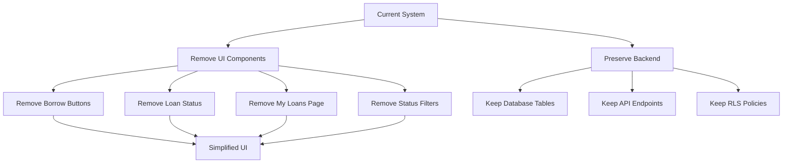

# Remove Loan/Borrow Features - Design Document

## 1. Overview

This design outlines the removal of loan and borrow-related UI elements from the digital library system while preserving all backend infrastructure. The approach is conservative: remove only frontend code, comment out rather than delete where appropriate, and maintain full backend functionality for potential future use.

## 2. Architecture

### 2.1 Removal Strategy



### 2.2 Component Changes

**Components to Modify:**
- `App.tsx` - Remove borrow request handlers, status filters
- `components/BookDetailsModal.tsx` - Remove borrow button, loan status
- `components/BookCard.tsx` - Remove loan status badges
- `components/Navbar.tsx` - Remove "My Loans" navigation link
- `types.ts` - Mark loan types as deprecated

**Components to Remove:**
- `components/MyLoans.tsx` - Delete entire component

**Backend to Preserve:**
- All database tables (loans, borrow_requests, waitlist)
- All API endpoints in `server.js`
- All RLS policies
- All test files (mark as inactive)

## 3. Components and Interfaces

### 3.1 App.tsx Modifications

**Remove:**
```typescript
// Remove borrow request handler
const handleBorrowRequest = async (bookId: string) => {
  // ... remove this entire function
};

// Remove status filter options
const statusOptions = ['All', 'Available']; // Remove 'Borrowed', 'Waitlist'
```

**Keep:**
```typescript
// Keep book fetching
// Keep search functionality
// Keep category filtering
```

### 3.2 BookDetailsModal.tsx Modifications

**Remove:**
```typescript
// Remove borrow request button
{status === 'AVAILABLE' && (
  <button onClick={() => onBorrowRequest(book.id)}>
    Request to Borrow
  </button>
)}

// Remove loan status badges
{status === 'BORROWED' && <Badge>Borrowed</Badge>}
{status === 'WAITLIST' && <Badge>Waitlist</Badge>}

// Remove physical copies display
<div>Physical Copies Available: {copiesAvailable}/{totalCopies}</div>
```

**Keep:**
```typescript
// Keep book information display
// Keep read online button
// Keep download PDF button
// Keep description and metadata
```

### 3.3 BookCard.tsx Modifications

**Remove:**
```typescript
// Remove status badge rendering for BORROWED/WAITLIST
{status === 'BORROWED' && <StatusBadge>Borrowed</StatusBadge>}
{status === 'WAITLIST' && <StatusBadge>Waitlist</StatusBadge>}
```

**Simplify:**
```typescript
// Simplify to show only available or no badge
{status === 'AVAILABLE' && <StatusBadge>Available</StatusBadge>}
// Or remove status badge entirely since all books are available
```

### 3.4 Navbar.tsx Modifications

**Remove:**
```typescript
// Remove My Loans navigation link
<NavLink to="/loans">My Loans</NavLink>
```

**Keep:**
```typescript
// Keep all other navigation links
// Keep user profile
// Keep admin links
```

### 3.5 MyLoans.tsx Component

**Action:** Delete entire file

**Rationale:** This component serves no purpose without loan functionality

### 3.6 types.ts Modifications

**Mark as Deprecated:**
```typescript
/**
 * @deprecated Loan features are disabled. Type preserved for backend compatibility.
 */
export interface Loan {
  id: string;
  checkoutDate: string;
  dueDate: string;
  // ... rest of interface
}

/**
 * Book status enum
 * Note: BORROWED and WAITLIST are no longer used in UI
 */
export enum BookStatus {
  AVAILABLE = 'AVAILABLE',
  BORROWED = 'BORROWED',    // Preserved for backend
  WAITLIST = 'WAITLIST'     // Preserved for backend
}
```

## 4. Data Models

### 4.1 Frontend Data Models

**Remove from Active Use:**
- `Loan` interface (mark as deprecated)
- `BorrowRequest` interface (mark as deprecated)
- `copiesAvailable` field from Book display
- `totalCopies` field from Book display

**Keep in Type Definitions:**
- All types preserved for backend compatibility
- Marked with `@deprecated` JSDoc comments

### 4.2 Backend Data Models (No Changes)

All database tables remain unchanged:
- `loans` table
- `borrow_requests` table
- `waitlist` table
- `books` table (all columns preserved)

## 5. Correctness Properties

*A property is a characteristic or behavior that should hold true across all valid executions of a system—essentially, a formal statement about what the system should do. Properties serve as the bridge between human-readable specifications and machine-verifiable correctness guarantees.*

Since this is primarily a removal task, properties focus on ensuring complete removal and preservation:

Property 1: Borrow Button Absence
*For any* book details modal rendered in the UI, the borrow request button SHALL NOT be present in the DOM.
**Validates: Requirements 5.1**

Property 2: Loan Status Badge Absence
*For any* book card rendered in the UI, BORROWED and WAITLIST status badges SHALL NOT be present in the DOM.
**Validates: Requirements 5.2**

Property 3: Status Filter Simplification
*For any* browse page render, the status filter options SHALL contain only "All" and "Available", and SHALL NOT contain "Borrowed" or "Waitlist".
**Validates: Requirements 5.3**

Property 4: My Loans Navigation Absence
*For any* navigation menu render, the "My Loans" link SHALL NOT be present in the DOM.
**Validates: Requirements 5.4**

Property 5: Physical Copies Display Absence
*For any* book details modal rendered, physical copy availability information SHALL NOT be displayed.
**Validates: Requirements 5.5**

Property 6: Backend Table Preservation
*For any* database inspection, the loans, borrow_requests, and waitlist tables SHALL exist and be queryable.
**Validates: Requirements 5.6**

Property 7: API Endpoint Preservation
*For any* API endpoint related to loans or borrow requests, the endpoint SHALL respond (even if unused by frontend).
**Validates: Requirements 5.6**

Property 8: Type Definition Preservation
*For any* TypeScript compilation, loan-related types SHALL be present and marked as deprecated.
**Validates: Requirements 5.7**

## 6. Error Handling

### 6.1 Route Handling

**Removed Routes:**
- `/loans` route should redirect to home page
- Handle gracefully if user has bookmarked the old URL

**Implementation:**
```typescript
// In App.tsx routing
<Route path="/loans" element={<Navigate to="/" replace />} />
```

### 6.2 Prop Validation

**Remove Props:**
- Remove `onBorrowRequest` prop from BookDetailsModal
- Remove loan-related props from BookCard
- Update prop types to reflect removals

### 6.3 API Call Removal

**Remove API Calls:**
- Remove borrow request POST calls
- Remove loan fetching GET calls
- Remove waitlist join calls

**Keep Error Handling:**
- Existing error boundaries remain functional
- No new error cases introduced

## 7. Testing Strategy

### 7.1 Visual Testing

**Manual Testing Checklist:**
- [ ] Browse page shows no BORROWED/WAITLIST filters
- [ ] Book cards show no loan status badges
- [ ] Book details modal shows no borrow button
- [ ] Book details modal shows no physical copies info
- [ ] Navigation menu shows no "My Loans" link
- [ ] /loans route redirects to home page

### 7.2 Property-Based Testing

Since this is a removal task, property tests focus on absence:

1. **UI Element Absence Test**
   - Render all components
   - Query for loan-related elements
   - Assert they don't exist

2. **Backend Preservation Test**
   - Query database for tables
   - Assert tables exist
   - Query API endpoints
   - Assert endpoints respond

### 7.3 Integration Testing

**Test Scenarios:**
- User browses books (no loan UI visible)
- User views book details (no borrow button)
- User navigates app (no My Loans link)
- Direct access to /loans redirects properly

### 7.4 Regression Testing

**Ensure No Breaking Changes:**
- Book search still works
- Book filtering still works
- Book details display still works
- User authentication still works
- Admin features still work

## 8. Deployment Considerations

### 8.1 No Database Migration Required

**Rationale:** All database tables are preserved, no schema changes needed.

**Deployment Steps:**
1. Deploy frontend code changes
2. No backend changes required
3. No database migration required

### 8.2 Rollback Plan

**If Issues Arise:**
1. Revert frontend deployment
2. No database rollback needed (nothing changed)
3. All functionality restored immediately

### 8.3 Feature Flags (Optional)

**Environment Variable:**
```
ENABLE_LOAN_FEATURES=false  # Default: false
```

**Usage:**
- Can be used to conditionally render loan UI
- Allows easy re-enablement without code changes
- Useful for A/B testing or gradual rollout

## 9. Documentation Updates

### 9.1 Code Comments

**Add Comments:**
```typescript
// LOAN FEATURES DISABLED: The following code is commented out but preserved
// for potential future use. To re-enable, uncomment and restore navigation.
// 
// const handleBorrowRequest = async (bookId: string) => {
//   ...
// };
```

### 9.2 README Updates

**Document Changes:**
- Note that loan features are disabled
- Explain that backend is preserved
- Provide instructions for re-enabling

### 9.3 User-Facing Documentation

**Update Help/FAQ:**
- Remove references to borrowing physical books
- Emphasize digital-only access
- Update screenshots to reflect new UI

## 10. Future Enhancements

### 10.1 Re-enabling Loans

**If Physical Lending is Added:**
1. Uncomment UI code
2. Re-add navigation links
3. Enable API calls
4. Test with existing backend
5. Update documentation

### 10.2 Digital Lending

**If Time-Limited Digital Access is Needed:**
1. Adapt existing loan tables for digital lending
2. Modify UI to show digital loan status
3. Implement time-based access control
4. Add download restrictions during loan period

### 10.3 Reservation System

**If Book Reservations are Needed:**
1. Repurpose waitlist table for reservations
2. Add reservation UI
3. Implement notification system
4. Track reservation fulfillment
