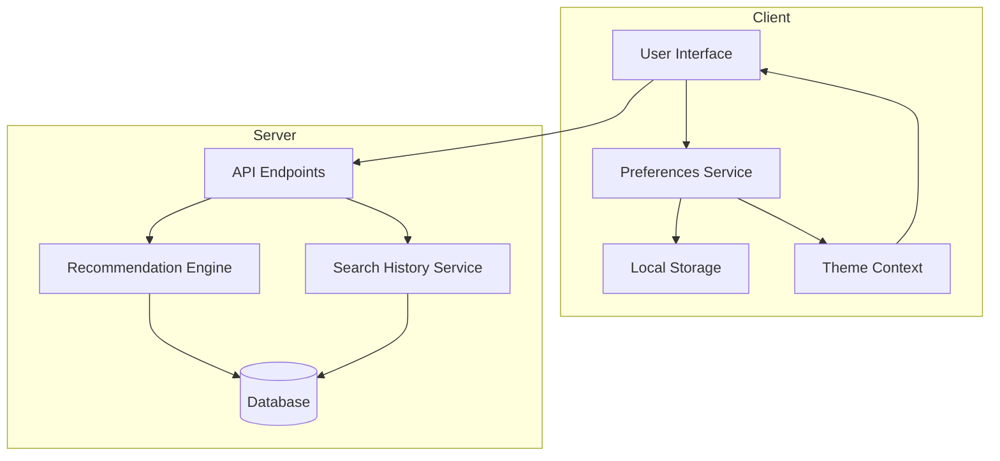

# Design Document: User Preferences and Enhanced Recommendations

## Overview

This design document outlines the architecture and implementation for enhanced book recommendations and user display preferences in the Drizaikn Digital Library. The system will provide personalized recommendations based on search history and course/major, allow users to customize icon sizes and view layouts, toggle dark/light mode, and select from professional theme color combinations.

## Architecture

The feature follows a client-side preference management pattern with server-side recommendation generation:



## Components and Interfaces

### 1. Preferences Service (Client-Side)

```typescript
// services/preferencesService.ts

export type IconSize = 'xs' | 'sm' | 'md' | 'lg' | 'xl';
export type ViewLayout = 'grid' | 'list' | 'compact' | 'table';
export type ThemeMode = 'light' | 'dark';
export type ThemeColor = 'classic' | 'modern' | 'elegant';

export interface UserPreferences {
  iconSize: IconSize;
  viewLayout: ViewLayout;
  themeMode: ThemeMode;
  themeColor: ThemeColor;
}

export interface PreferencesService {
  getPreferences(): UserPreferences;
  setIconSize(size: IconSize): void;
  setViewLayout(layout: ViewLayout): void;
  setThemeMode(mode: ThemeMode): void;
  setThemeColor(color: ThemeColor): void;
  resetToDefaults(): void;
}
```

### 2. Theme Configuration

```typescript
// constants/themes.ts

export interface ThemeColors {
  primary: string;
  accent: string;
  background: string;
  text: string;
  textSecondary: string;
  border: string;
  cardBg: string;
}

export const THEME_COLORS: Record<ThemeColor, { light: ThemeColors; dark: ThemeColors }> = {
  classic: {
    light: {
      primary: '#1A365D',      // Navy blue
      accent: '#DC2626',       // Red
      background: '#FFFFFF',   // White
      text: '#1A365D',
      textSecondary: '#64748B',
      border: '#E2E8F0',
      cardBg: '#FFFFFF'
    },
    dark: {
      primary: '#3B82F6',
      accent: '#EF4444',
      background: '#0F172A',
      text: '#F8FAFC',
      textSecondary: '#94A3B8',
      border: '#334155',
      cardBg: '#1E293B'
    }
  },
  modern: {
    light: {
      primary: '#2563EB',      // Royal blue
      accent: '#B91C1C',       // Crimson red
      background: '#F8FAFC',   // Off-white
      text: '#1E293B',
      textSecondary: '#64748B',
      border: '#E2E8F0',
      cardBg: '#FFFFFF'
    },
    dark: {
      primary: '#60A5FA',
      accent: '#F87171',
      background: '#0F172A',
      text: '#F1F5F9',
      textSecondary: '#94A3B8',
      border: '#334155',
      cardBg: '#1E293B'
    }
  },
  elegant: {
    light: {
      primary: '#0F172A',      // Deep navy
      accent: '#EF4444',       // Coral red
      background: '#FFFBEB',   // Warm white
      text: '#0F172A',
      textSecondary: '#57534E',
      border: '#D6D3D1',
      cardBg: '#FFFFFF'
    },
    dark: {
      primary: '#818CF8',
      accent: '#FB7185',
      background: '#18181B',
      text: '#FAFAF9',
      textSecondary: '#A8A29E',
      border: '#3F3F46',
      cardBg: '#27272A'
    }
  }
};

export const ICON_SIZES: Record<IconSize, { card: string; image: string; text: string }> = {
  xs: { card: 'w-24', image: 'h-32', text: 'text-xs' },
  sm: { card: 'w-32', image: 'h-44', text: 'text-sm' },
  md: { card: 'w-40', image: 'h-56', text: 'text-base' },
  lg: { card: 'w-48', image: 'h-64', text: 'text-lg' },
  xl: { card: 'w-56', image: 'h-72', text: 'text-xl' }
};
```

### 3. Search History API

```typescript
// API Endpoints

// POST /api/search-history
// Records a search query or book view
interface SearchHistoryEntry {
  userId: string;
  type: 'search' | 'view';
  query?: string;
  bookId?: string;
  timestamp: string;
}

// GET /api/search-history/:userId
// Returns recent search history (max 50 entries)

// DELETE /api/search-history/:userId
// Clears all search history for user

// GET /api/books/recommendations/:userId
// Enhanced to include search history in recommendation algorithm
```

### 4. Preferences Toolbar Component

```typescript
// components/PreferencesToolbar.tsx

interface PreferencesToolbarProps {
  iconSize: IconSize;
  viewLayout: ViewLayout;
  themeMode: ThemeMode;
  themeColor: ThemeColor;
  onIconSizeChange: (size: IconSize) => void;
  onViewLayoutChange: (layout: ViewLayout) => void;
  onThemeModeChange: (mode: ThemeMode) => void;
  onThemeColorChange: (color: ThemeColor) => void;
}
```

### 5. View Layout Components

```typescript
// components/BookGrid.tsx - Grid view (default)
// components/BookList.tsx - List view with horizontal details
// components/BookCompact.tsx - Dense grid with minimal info
// components/BookTable.tsx - Tabular view with sortable columns
```

## Data Models

### Search History Table (Supabase)

```sql
CREATE TABLE search_history (
  id UUID PRIMARY KEY DEFAULT gen_random_uuid(),
  user_id UUID REFERENCES users(id) ON DELETE CASCADE,
  type VARCHAR(10) NOT NULL CHECK (type IN ('search', 'view')),
  query TEXT,
  book_id UUID REFERENCES books(id) ON DELETE SET NULL,
  created_at TIMESTAMP WITH TIME ZONE DEFAULT NOW()
);

CREATE INDEX idx_search_history_user ON search_history(user_id);
CREATE INDEX idx_search_history_created ON search_history(created_at DESC);
```

### Local Storage Schema

```typescript
interface StoredPreferences {
  iconSize: IconSize;      // Default: 'md'
  viewLayout: ViewLayout;  // Default: 'grid'
  themeMode: ThemeMode;    // Default: 'light'
  themeColor: ThemeColor;  // Default: 'classic'
}

// Storage key: 'puea_library_preferences'
```

## Correctness Properties

*A property is a characteristic or behavior that should hold true across all valid executions of a system-essentially, a formal statement about what the system should do. Properties serve as the bridge between human-readable specifications and machine-verifiable correctness guarantees.*

### Property 1: Preferences Round-Trip Persistence
*For any* valid user preference (icon size, view layout, theme mode, or theme color), saving the preference to local storage and then retrieving it should return the same value.
**Validates: Requirements 2.3, 2.4, 3.6, 3.7, 6.4, 6.5, 7.6, 7.7**

### Property 2: Recommendation Generation Includes Search History
*For any* user with search history entries, the recommendation engine should return books that match at least one search term from the history when relevant books exist.
**Validates: Requirements 1.1, 1.3**

### Property 3: Recommendation Generation Includes Course
*For any* user with a course/major set, the recommendation engine should prioritize books from categories mapped to that course.
**Validates: Requirements 1.2, 1.3**

### Property 4: Recommendation Count Limit
*For any* recommendation request, the returned list should contain at most 10 books.
**Validates: Requirements 1.5**

### Property 5: Search History Recording
*For any* search query performed by a user, the search history should contain an entry with that query and a valid timestamp.
**Validates: Requirements 1.6, 5.1**

### Property 6: Book View Recording
*For any* book detail view by a user, the search history should contain an entry for that book ID.
**Validates: Requirements 5.2**

### Property 7: Search History Limit
*For any* recommendation generation, only the most recent 50 search history entries should be considered.
**Validates: Requirements 5.3**

### Property 8: Search History Clear
*For any* user who clears their search history, the search history count for that user should be zero.
**Validates: Requirements 5.4**

### Property 9: Theme Mode Application
*For any* theme mode selection (light or dark), the document root should have the corresponding CSS class applied.
**Validates: Requirements 6.2, 6.3, 6.7**

### Property 10: Theme Color Application
*For any* theme color selection, the CSS custom properties should reflect the correct color values for that theme.
**Validates: Requirements 7.5**

### Property 11: Icon Size Application
*For any* icon size selection, the book card components should have the corresponding size classes applied.
**Validates: Requirements 2.2**

## Error Handling

1. **Local Storage Unavailable**: Fall back to in-memory preferences for the session
2. **Invalid Stored Preferences**: Reset to defaults and log warning
3. **API Failures**: 
   - Search history recording: Queue for retry, don't block user action
   - Recommendations: Fall back to popular books
4. **Theme Application Errors**: Fall back to light mode with classic theme

## Testing Strategy

### Unit Tests
- Preferences service: get/set operations, default values
- Theme color calculations and CSS variable generation
- Icon size class mapping
- View layout component rendering

### Property-Based Tests
Using fast-check library for TypeScript:

1. **Preferences Round-Trip**: Generate random valid preferences, save and retrieve, verify equality
2. **Recommendation Limits**: Generate random book catalogs and user histories, verify max 10 results
3. **Search History Recording**: Generate random search queries, verify they appear in history
4. **Theme Application**: Generate random theme combinations, verify CSS classes are applied

### Integration Tests
- Full flow: User changes preferences → stored → page reload → preferences restored
- Recommendation API with various user states (no history, history only, course only, both)
- Search history CRUD operations
